# Story Assistant

A full-stack app for co-writing fiction with an AI, one paragraph at a time.
You create characters and a story, break the story into chapters, and then —
chapter by chapter — ask the AI to write the next bit, read what it wrote,
either keep it or throw it away and try again, and repeat until the chapter
is done.

This document covers the whole system: what it does, how it's built, how a
user actually moves through it, the architectural decisions that shape the
backend and the LLM workflow, a folder-by-folder tour of the codebase, and
how to get it running.

---

## 1. What the app is about

Most "AI writing" tools either generate a whole story in one shot (low
control, generic output) or act as a blank-page autocomplete (no persistent
sense of who the characters are or what already happened). This app sits
between those: it keeps a durable **story bible** and **character sheets**
that get fed into every generation call, and it treats each AI-written
paragraph as a **draft** the writer explicitly approves before it becomes
permanent — never auto-committed, never silently rewritten.

The three things it's actually optimized for:

- **Continuity** — characters, relationships, and prior chapters are
  structured data, not something re-typed into a prompt by hand each time.
- **Control** — nothing the AI writes is final until the writer accepts it;
  every draft can be edited, regenerated, or discarded first.
- **Speed of iteration** — generation streams token-by-token, and the
  "try again" loop (regenerate → discard → regenerate) never touches the
  database, so experimenting is cheap.

---

## 2. System architecture

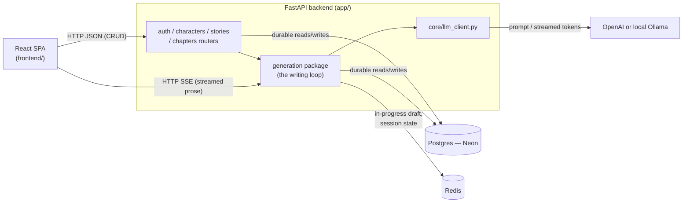

Three storage systems, each with exactly one job:

- **Postgres (Neon)** — the permanent record: users, stories, characters,
  chapters, and every paragraph that's been *accepted*. If it's in
  Postgres, it's final.
- **Redis** — short-term memory for whichever chapter is actively being
  written: the AI's current draft (not yet accepted), the last few
  alternate drafts, and a running summary of the chapter so far. Losing it
  loses an in-progress draft, never finished work.
- **OpenAI or Ollama** — whichever is configured (`LLM_PROVIDER`). The only
  part that costs money or needs a GPU.

The frontend is a plain client-side SPA — no server-side rendering, a
bearer JWT in `localStorage`, talking to the backend over JSON for CRUD and
Server-Sent Events for generation.

---

## 3. User workflow

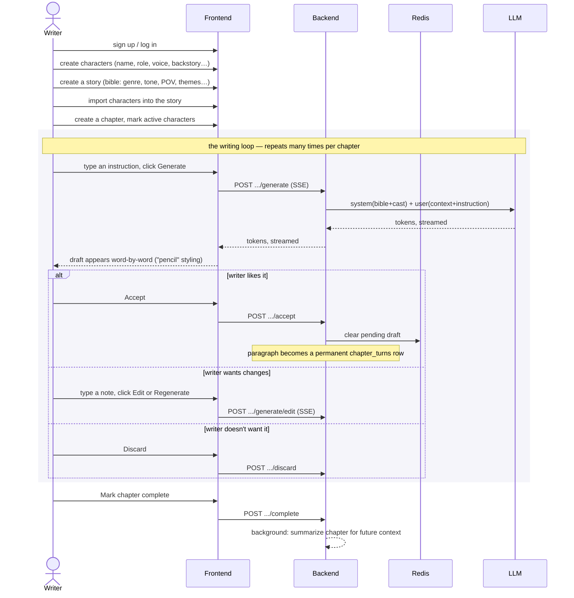

A few things that matter about this loop:

- **Nothing the AI writes is real until accepted.** Regenerating,
  discarding, and hand-editing all happen in Redis — the writer can
  experiment freely without touching the database.
- **Adding a character mid-chapter** doesn't retroactively rewrite the
  pending draft — it only affects the *next* generation call, and the UI
  says so explicitly.
- **Completing a chapter** triggers a background job that summarizes it, so
  *future* chapters remember what happened without re-reading the whole
  thing.

---

## 4. Core functionality — from the writer's point of view

This is what the app actually gets you, day to day:

- **Build a cast once, reuse it everywhere.** Write a character's voice,
  backstory, and personality a single time. Every scene they're active in
  automatically carries that context into generation — you're never
  re-explaining "she's sarcastic and still grieving her sister" in every
  prompt by hand.
- **Give the AI a story bible instead of a blank page.** Genre, tone, POV,
  tense, themes, content boundaries, target audience, writing-style
  notes — set once per story, and every generation call respects them
  without you repeating yourself.
- **Nothing lands in your manuscript without your say-so.** Every AI
  paragraph is a draft first, shown in a visually distinct "pencil" style.
  Read it, then decide: keep it, ask for a rewrite, or throw it away. The
  actual chapter text never changes until you explicitly accept.
- **Trying five different openings costs nothing.** Regenerating or
  discarding a draft never touches the database — only accepting does. You
  can iterate on a paragraph as many times as you want with zero
  consequence to the real manuscript.
- **Watch it write, don't wait for it.** Generation streams word-by-word
  instead of appearing all at once after a long pause — you can tell within
  a sentence or two whether a draft is worth reading to the end.
- **Add a character mid-scene without breaking your flow.** Realize you
  need someone new halfway through writing? Create them and drop them into
  the current chapter in one step — the UI nudges "[Name] enters the
  scene" into your next instruction and is explicit that it only affects
  the *next* generation, not the draft you're currently looking at.
- **The story remembers, so you don't have to re-explain it.** Finish a
  chapter and it's summarized automatically in the background. Every later
  chapter's generation calls include what already happened — no manually
  copy-pasting a recap into the prompt.
- **A finished chapter can't be regenerated out from under you by
  accident.** Lock a chapter once you consider it truly done, and
  generation is blocked until you explicitly unlock it again.
- **You always know exactly where a story or chapter stands.** Stories move
  through `draft → ongoing → (on hold, or finished, or abandoned)`.
  Chapters move through `draft → being written → awaiting your review →
  complete → (optionally) locked`. Status is never a guess.
- **A relationship between two characters actually shapes the prose.**
  Mark two characters as "sworn enemies who used to be lovers" and that
  context reaches the model whenever they're in a scene together — it's
  not just metadata sitting unused in a database.

### Quick reference

| Area | What it does |
|---|---|
| **Auth** | Email/password signup and login, JWT bearer tokens. |
| **Characters** | Full sheet (name, role, age, pronouns, appearance, voice notes, personality traits, motivation, flaw, backstory) plus directional relationships between characters. |
| **Stories** | Story bible (title, genre, tone, POV, tense, rating, premise, opening line, setting, themes, content boundaries, writing style notes, target audience) plus which characters are imported into it. |
| **Chapters** | Ordered within a story, own active-character subset, reorderable, archivable, lockable. |
| **The writing loop** | Streamed generation, edit-in-place, regenerate (keeps discarded drafts as restorable "sibling attempts", up to 3), manual hand-editing, accept, discard. |
| **Continuity** | Two background summarization triggers: one compacts a long chapter's older text as it's written; one summarizes a completed chapter for future chapters to reference. |
| **Status lifecycle** | Stories: `draft → ongoing ⇄ on_hold → completed/abandoned` (reopenable). Chapters: `draft → in_progress → in_review → complete → locked` (reversible). |

---

## 5. Major architectural decisions

### From the LLM-workflow point of view

**System/user message split, not one flat prompt.**

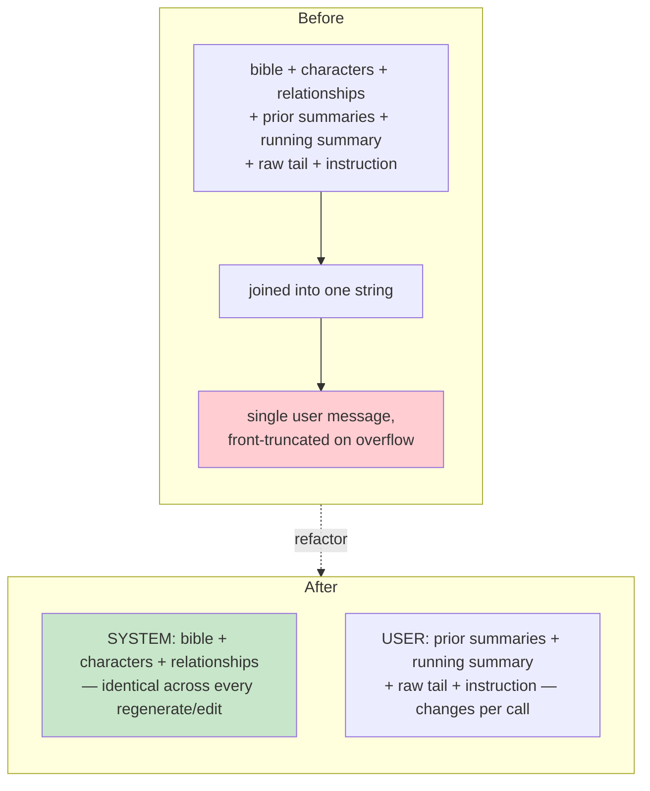

The story bible, active characters, and their relationships are stable
across every regenerate/edit within a chapter — they go in `system`. Prior
summaries, recent text, and the instruction change per call — they go in
`user`. This enables prefix reuse (OpenAI's automatic cache above ~1024
tokens; Ollama's own KV-cache with no minimum) and, as a side effect, means
budget trimming can never eat into the bible by accident.

**Section-aware budget trimming, not blind truncation.**

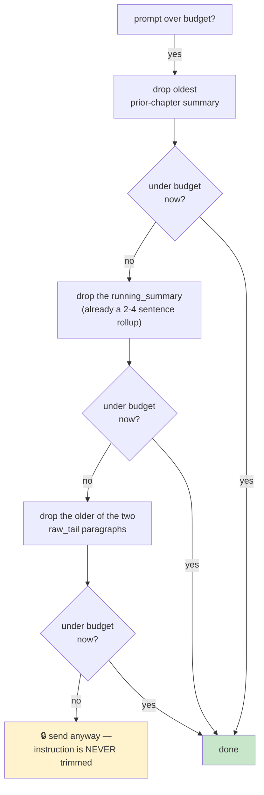

Content is dropped in explicit priority order when a prompt is too long —
cheapest-to-lose first. The instruction and, on the edit path, the current
draft are never trimmed, even if that means sending an over-budget prompt.

**Streaming forced a real architectural split, not just a flag.**

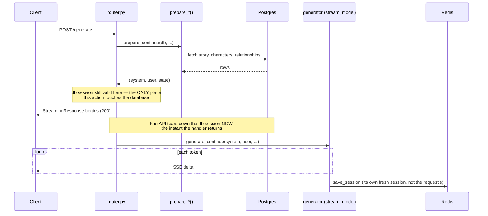

FastAPI tears down a `Depends(get_db)` session the instant a route handler
*returns* — for a `StreamingResponse` that happens immediately, before the
generator body has run at all. So every generation action is split into a
`prepare_*` step (all DB work, while the session is valid) and a pure
streaming generator (no DB access at all, just tokens in and out, then a
Redis write at the end).

**Ollama gets its own code path, not the OpenAI-compatible shim it also
exposes.**

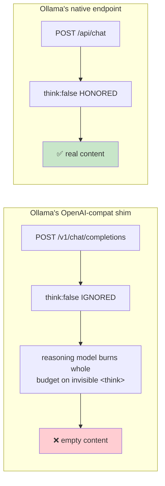

Verified directly: Ollama's OpenAI-compat endpoint silently ignores
`"think": false`, so a reasoning model (`qwen3.6`) burns its entire token
budget on invisible chain-of-thought and returns empty content. Its native
`/api/chat` endpoint honors the flag correctly, so that's what's actually
called for the Ollama provider.

**Retry/backoff only on non-streaming calls.**

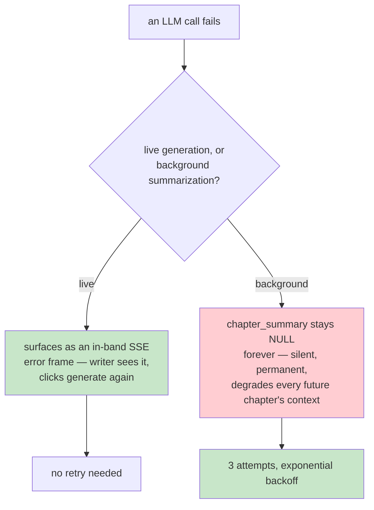

Retry effort goes where the failure mode is actually dangerous — a live
failure is visible and cheaply retried by the user; a background failure
is invisible and permanent unless the code itself retries.

**A manual resummarize endpoint exists as an escape hatch.**

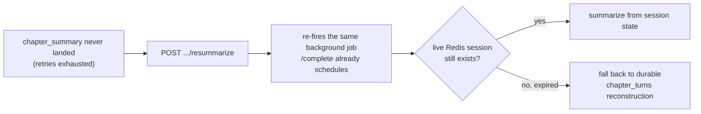

### From the backend point of view

**Domain folders, not layer folders.**

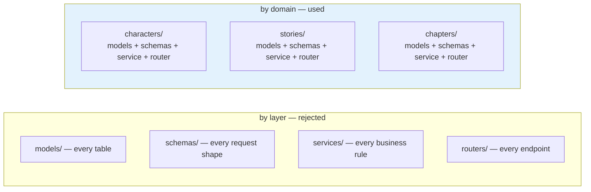

`app/characters/`, `app/stories/`, etc. each contain their own
`models.py` / `schemas.py` / `service.py` / `router.py`. Things that change
together live together — a "characters" bug means opening one folder, not
four.

**Strict downward dependency order, with two deliberate exceptions.**

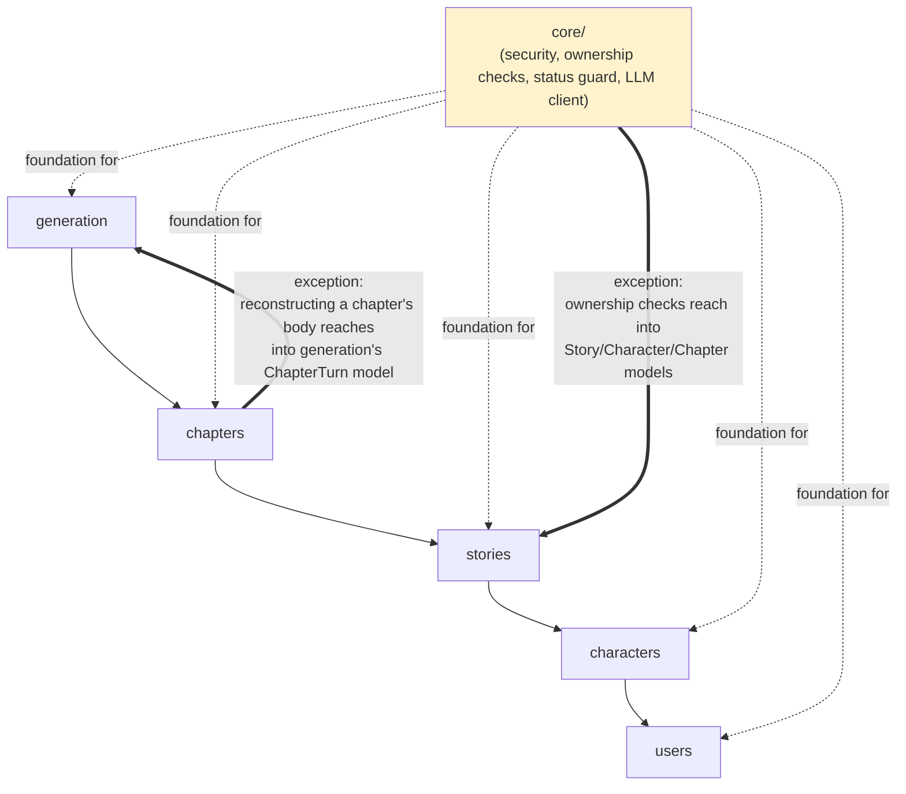

Each domain may only import from domains *below* it. The two exceptions
exist because the alternative — duplicating the same logic in every caller
— was worse than bending the rule once, in one well-documented place.

**UUID primary keys, not auto-increment.**

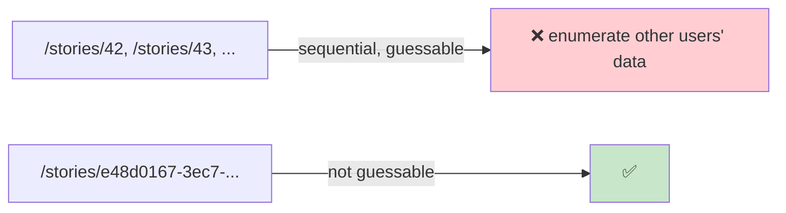

**No hard deletes — everything is archived.**

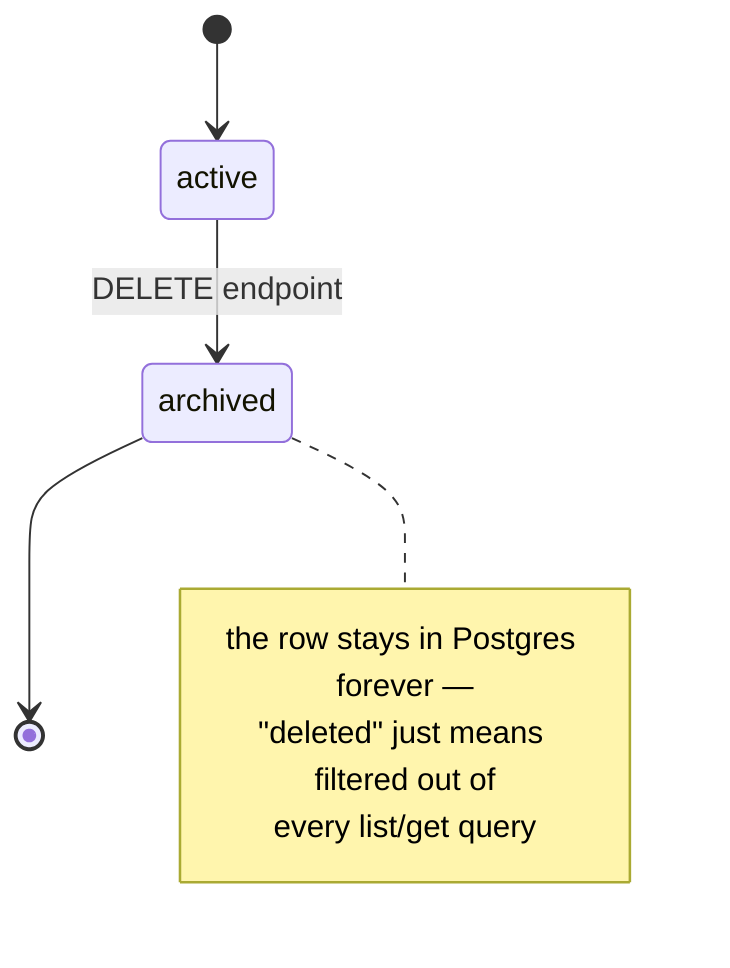

**A chapter's text has no `body` column — it's reconstructed on read.**

```mermaid
flowchart LR
    T1["turn 1\n(accepted paragraph)"] --> J["\"\\n\\n\".join()\non every read"]
    T2["turn 2"] --> J
    T3["turn 3"] --> J
    J --> Body["chapter body\n— never stored, always rebuilt"]
```

Each accepted paragraph needs its own `chapter_turns` row anyway (so the AI
can later be told which instruction produced which paragraph) — a flat
`body` column would just be a second representation to keep in sync.

**Two separate cast tables, not one.**

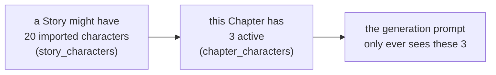

Collapsing these into one table would mean every scene's prompt includes
the story's entire cast, blowing up the token budget and confusing the
model about who's actually present.

**Status transitions go through one shared choke point, not scattered
`if` checks.**

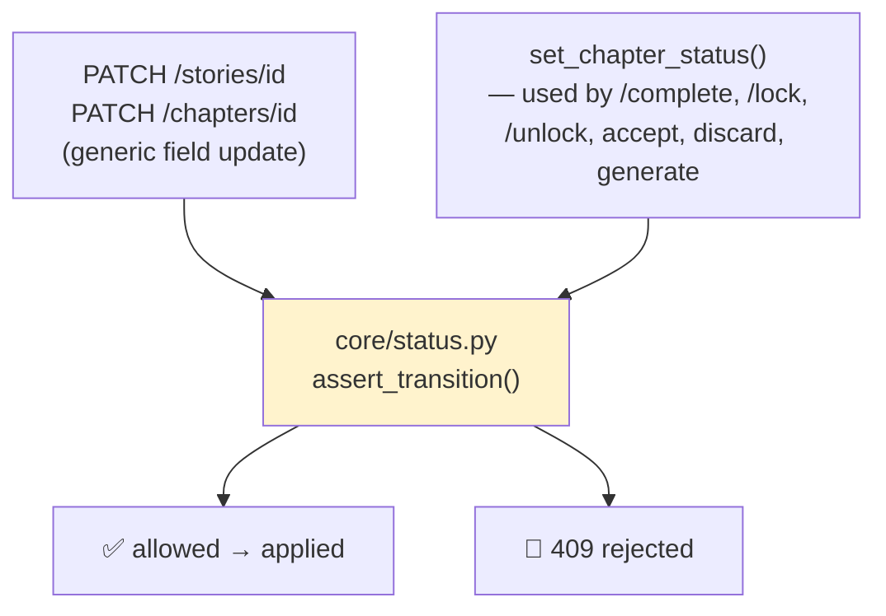

A bare `PATCH status="complete"` used to silently bypass the summarization
trigger entirely — both write paths now run through the same allow-list.

**No migration tool.**

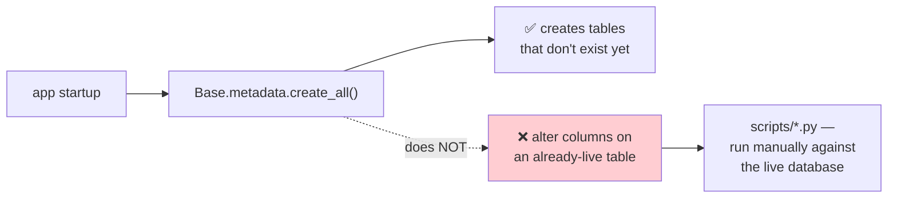

Deliberate for a single-developer project; revisit if this ever needs
versioned migrations against a shared production database.

**Connection pool tuned for serverless Postgres.**

```mermaid
sequenceDiagram
    participant App
    participant Pool as SQLAlchemy Pool
    participant Neon
    Note over Pool,Neon: connection sits idle past Neon's timeout
    Neon-->>Pool: silently drops it
    App->>Pool: checkout
    Pool-->>App: hands out a DEAD connection
    App->>Neon: query
    Neon--xApp: 💥 without pool_pre_ping, this 500s
    Note over App,Neon: pool_pre_ping=True catches this transparently;<br/>pool_recycle=300 retires connections before they go stale
```

**Foreign-key columns are indexed on the hot paths.**

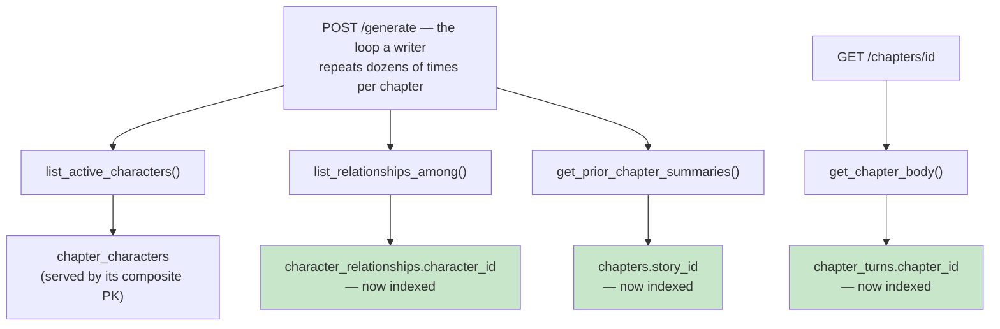

Postgres does not index foreign keys automatically — these were previously
full table scans on every single generate/edit call, the core loop a
writer repeats constantly.

### From the frontend point of view

**Client state mirrors server state; it doesn't own it.**

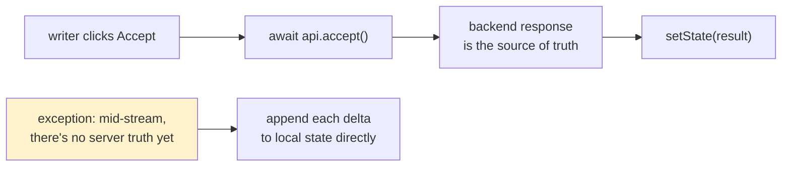

Every mutating action calls the backend and updates local state from the
result, so the client can't silently drift from what's actually in
Redis/Postgres. The one deliberate exception is while a generation is
streaming — there's nothing to mirror yet until the stream finishes.

**One visual metaphor carries the whole writing room.**

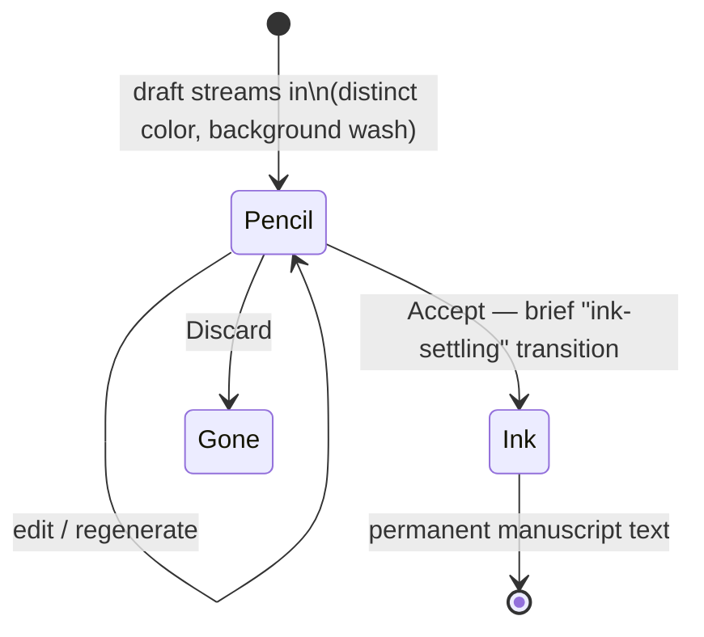

Accepted text renders as typeset manuscript on a lit "paper" panel; a
pending draft renders in a visually distinct "pencil" style — a
provisional suggestion, not yet committed to the page.

---

## 6. Project folder structure

```mermaid
flowchart TD
    Root["Story/"]
    Root --> App["app/  — FastAPI backend"]
    Root --> FE["frontend/  — React SPA"]
    Root --> Scripts["scripts/  — one-off DB migration scripts"]
    Root --> Tests["tests/  — smoke test"]

    App --> Core["core/ — security, ownership checks,\nstatus state machine, LLM client"]
    App --> Auth["auth/ — signup, login, /me"]
    App --> Users["users/ — User model only"]
    App --> Characters["characters/ — character CRUD, relationships"]
    App --> Stories["stories/ — story bible CRUD, cast import"]
    App --> Chapters["chapters/ — chapter CRUD, reorder,\nactive cast, lock/unlock"]
    App --> Generation["generation/ — the writing loop"]

    FE --> Lib["lib/ — API client, auth context, types"]
    FE --> Components["components/ — nav shell, route guard"]
    FE --> Features["features/ — one folder per screen"]
    Features --> FAuth["auth/"]
    Features --> FChar["characters/"]
    Features --> FStory["stories/"]
    Features --> FRoom["writing-room/"]
```

```
Story/
├── app/
│   ├── main.py              FastAPI() instance, router registration, table
│   │                        creation on startup, CORS
│   ├── config.py            Settings (env vars)
│   ├── database.py          async engine/session, Base, uuid_pk()
│   ├── core/
│   │   ├── security.py      password hashing, JWT
│   │   ├── deps.py          get_db, get_current_user, ownership checks
│   │   ├── status.py        shared status-transition guard
│   │   └── llm_client.py    OpenAI / Ollama dispatch, retry, streaming
│   ├── auth/                router.py, schemas.py, service.py
│   ├── users/                models.py only
│   ├── characters/           models / schemas / service / router
│   ├── stories/               models / schemas / service / router
│   ├── chapters/               models / schemas / service / router
│   └── generation/              models, schemas, session_store,
│                                 assembler, summarizer, service, router
├── frontend/
│   └── src/
│       ├── lib/               apiFetch.ts, auth.tsx, types.ts
│       ├── components/        AppShell.tsx, ProtectedRoute.tsx
│       └── features/
│           ├── auth/          LoginPage, SignupPage
│           ├── characters/    CharactersPage + API
│           ├── stories/       StoriesListPage, StoryDetailPage + API
│           ├── chapters/      API only (managed from StoryDetailPage)
│           └── writing-room/  WritingRoom.tsx + hooks + API
├── scripts/
│   └── migrate_optimizations.py   one-off ALTER TABLE / ALTER TYPE script
└── tests/
    └── test_smoke.py         full-flow test against a real Postgres
```

---

## 7. Backend folders, in detail

### `app/core/` — shared foundation

```mermaid
flowchart TD
    Sec["security.py\npassword hash, JWT encode/decode"]
    Deps["deps.py\nCurrentUser, get_owned_*"]
    Status["status.py\nassert_transition"]
    LLM["llm_client.py\ncall_model, stream_model"]
    Sec --> Deps
    Every["every domain's router"] --> Deps
    StoriesChapters["stories/, chapters/ services"] --> Status
    Generation["generation/"] --> LLM
    Summarizer["generation/summarizer.py"] --> LLM
```

- **`security.py`** — bcrypt password hashing, JWT create/decode.
- **`deps.py`** — FastAPI dependencies: `CurrentUser` (decodes the bearer
  token, loads the `User`), and `get_owned_story` / `get_owned_character` /
  `get_owned_chapter` — the "does this belong to you?" check, 404 rather
  than 403 so a non-owner can't even tell a resource exists.
- **`status.py`** — `assert_transition(current, new, allowed)`, the one
  function every status-changing write path calls.
- **`llm_client.py`** — the only file that talks to an LLM. `call_model()`
  (one-shot, retried, used by background summarization) and
  `stream_model()` (word-by-word, used by live generation). Both dispatch
  to OpenAI or Ollama based on `settings.llm_provider`.

### `app/auth/` — signup, login, "who am I"

```mermaid
flowchart LR
    Router["router.py\nPOST /signup\nPOST /login\nGET /me"] --> Service["service.py\ncreate_user()\nauthenticate_user()"]
    Service --> Sec["core/security.py\nhash_password, verify_password,\ncreate_access_token"]
    Service --> UserModel["users/models.py\nUser"]
```

Thin router, password/token logic in `service.py`.

### `app/users/` — just the `User` model

```mermaid
flowchart LR
    UserModel["users/models.py\nUser"]
    Auth["auth/"] --> UserModel
    Characters["characters/"] --> UserModel
    Stories["stories/"] --> UserModel
    Deps["core/deps.py"] --> UserModel
```

No router, no service — signup/login is a *workflow* that lives in `auth/`;
every other domain just imports `User` for foreign keys.

### `app/characters/` — the cast

```mermaid
flowchart TD
    Router["router.py"] --> Service["service.py"]
    Service --> Models["models.py\nCharacter, CharacterRelationship"]
    Service --> Schemas["schemas.py"]
    Chapters["chapters/service.py"] -.list_active_characters.-> Models
    Assembler["generation/assembler.py"] -.list_relationships_among.-> Service
```

CRUD (`create` / `list` / `get` / `update` / `archive`) plus directional
relationships between characters. `condensed_summary` is the short,
prompt-ready version of a character sheet — currently set by hand, no
auto-generator wired up yet.

### `app/stories/` — the story bible

```mermaid
flowchart TD
    Router["router.py"] --> Service["service.py"]
    Service --> Models["models.py\nStory, StoryCharacter,\nSTORY_TRANSITIONS"]
    Service --> Guard["core/status.py\nassert_transition"]
    Chapters["chapters/models.py"] --> Models
```

CRUD for the story itself, plus importing/removing characters
(`story_characters`). `StoryDetailRead` is the one schema that returns a
story with its imported characters nested inside.

### `app/chapters/` — chapters, and the seam to `generation/`

```mermaid
flowchart TD
    Router["router.py\n+ /reorder, /lock, /unlock,\n/characters/new"] --> Service["service.py"]
    Service --> Models["models.py\nChapter, ChapterCharacter,\nCHAPTER_TRANSITIONS"]
    Service --> Guard["core/status.py"]
    Service -.ChapterTurn.-> GenModels["generation/models.py"]
    GenService["generation/service.py"] --> Service
```

Owns the active-cast link table (`chapter_characters`), reordering,
lock/unlock, and several small helpers the writing loop depends on:
`list_active_characters`, `get_prior_chapter_summaries`,
`update_chapter_summary`, `set_chapter_status`,
`create_and_activate_character` (creates a new character *and* activates
it in one transaction — "someone just walked into the scene"), and
`get_chapter_body` (the turn-reconstruction helper).

### `app/generation/` — the writing loop itself

```mermaid
flowchart TD
    Router["router.py\nSSE endpoints"] --> Service["service.py"]
    Service --> Prep["prepare_continue / prepare_edit\n(DB work, request's own session)"]
    Service --> Gen["generate_continue / edit_pending\n(pure streaming, no DB)"]
    Prep --> Assembler["assembler.py\nbuilds (system, user)"]
    Gen --> LLMClient["core/llm_client.py"]
    Service --> SessionStore["session_store.py\nRedis scratch pad"]
    Service --> Summarizer["summarizer.py\ntwo background jobs"]
    Summarizer --> LLMClient
    Assembler --> Models["models.py\nChapterTurn"]
```

| File | Job |
|---|---|
| `models.py` | The one durable table, `chapter_turns` — one row per accepted paragraph. |
| `schemas.py` | Request/response shapes for the writing-loop endpoints. |
| `session_store.py` | Redis scratch pad for a chapter's in-progress draft. |
| `assembler.py` | Builds the `(system, user)` prompt actually sent to the LLM, with priority-ordered budget trimming. |
| `summarizer.py` | The two background summarization jobs. |
| `service.py` | Orchestrates generate / edit / accept / discard / complete / status transitions. |
| `router.py` | HTTP + SSE endpoints, nested under `/stories/{story_id}/chapters/{chapter_id}/...`. |

---

## 8. Frontend folders, in detail

### `src/lib/` — cross-cutting client code

- **`apiFetch.ts`** — `apiFetch()` for normal JSON requests, `apiStream()`
  for reading an SSE body. Both attach the bearer token and redirect to
  `/login` on a 401.
- **`auth.tsx`** — React context: current user, `login` / `signup` /
  `logout`.
- **`types.ts`** — TypeScript types mirroring the backend's Pydantic
  schemas (hand-written, not generated).

### `src/components/`

- **`AppShell.tsx`** — top nav bar.
- **`ProtectedRoute.tsx`** — redirects to `/login` if signed out.

### `src/features/` — one folder per screen, each pairing a thin `*Api.ts`
(one function per backend endpoint) with the page component(s) that use it:

- **`auth/`** — login and signup pages.
- **`characters/`** — roster page, full create form covering every backend
  field.
- **`stories/`** — list page; detail page with an editable story-bible
  form, cast import picker, and chapter list/creation.
- **`chapters/`** — API calls only; chapters are managed from
  `StoryDetailPage` and written from `WritingRoom`, no dedicated chapter
  page.
- **`writing-room/`** — the flagship screen:
  - `useChapterSession.ts` — the one hook holding the loop's state
    (accepted paragraphs, pending draft, sibling attempts, status).
  - `useDebouncedManualEdit.ts` — instant local typing, debounced
    (600ms) write to the backend.
  - `generationApi.ts` — the two streaming calls (`generate`,
    `generateEdit`) take an `onDelta` callback instead of returning a
    value, since the response is SSE, not JSON.
  - `WritingRoom.tsx` — the page: manuscript + pending draft + sibling
    attempts + compose bar + inline "add a character to this scene" +
    click-to-rename chapter title.

---

## 9. Getting started

```mermaid
flowchart LR
    A["clone repo"] --> B["backend: venv + pip install"]
    B --> C["configure .env\n(DB, Redis, LLM provider)"]
    C --> D["uvicorn app.main:app --reload"]
    D --> E["tables auto-created on boot\n(create_all — first run only)"]
    E --> F["frontend: npm install"]
    F --> G["configure .env\n(API base URL)"]
    G --> H["npm run dev"]
    H --> I["open localhost:5173,\nsign up, start writing"]
```

### Prerequisites

- Python 3.11+ and Node 18+
- A Postgres database — [Neon](https://neon.tech) (free tier works fine)
  or any local Postgres
- A reachable Redis instance
- Either an OpenAI API key, **or** a local [Ollama](https://ollama.com)
  install with a model already pulled (`ollama pull qwen3.6` or similar)

### 1. Backend

```bash
python3 -m venv .venv
.venv/bin/pip install -r requirements.txt
cp .env.example .env   # then fill in the values below
.venv/bin/uvicorn app.main:app --reload
```

Check it's up: `curl http://localhost:8000/health` → `{"status":"ok"}`.
Interactive API docs at `http://localhost:8000/docs`.

On a **brand-new** database, tables are created automatically on startup —
no separate migration step needed. `scripts/migrate_optimizations.py` (run
via `PYTHONPATH=. .venv/bin/python scripts/migrate_optimizations.py`) is
only needed if you're pointing at a database that predates certain schema
changes (new indexes, new status enum values) — safe to run regardless,
every statement is idempotent.

#### Backend environment variables (`.env`)

| Variable | Required | Default | Notes |
|---|---|---|---|
| `DATABASE_URL` | yes | — | `postgresql+asyncpg://...` — Neon's **pooled** (`-pooler`) endpoint. Neon's dashboard gives you a `postgresql://...?sslmode=require&channel_binding=require` string — swap the scheme to `postgresql+asyncpg://` and drop the query params, `asyncpg` doesn't parse them like `libpq` does. |
| `DATABASE_SSL_REQUIRE` | no | `true` | Set `false` only for local Postgres without SSL. |
| `DB_POOL_SIZE` | no | `5` | Base SQLAlchemy pool size. Neon's per-role connection ceiling varies by plan — check your dashboard before raising this. |
| `DB_MAX_OVERFLOW` | no | `5` | Extra connections allowed above `DB_POOL_SIZE` under burst load. |
| `JWT_SECRET` | yes | — | Any long random string. |
| `JWT_ALGORITHM` | no | `HS256` | |
| `ACCESS_TOKEN_EXPIRE_MINUTES` | no | `60` | |
| `REDIS_URL` | no | `redis://localhost:6379/0` | Needed for the writing loop's session store. |
| `LLM_PROVIDER` | no | `openai` | `"openai"` or `"ollama"`. |
| `OPENAI_API_KEY` | if provider is `openai` | — | |
| `OPENAI_MODEL` | no | `gpt-4o-mini` | |
| `OLLAMA_BASE_URL` | if provider is `ollama` | `http://localhost:11434` | The native API host — **not** `/v1`. |
| `OLLAMA_MODEL` | if provider is `ollama` | `qwen3.6:latest` | Must already be pulled locally. |

### 2. Frontend

```bash
cd frontend
npm install
cp .env.example .env   # VITE_API_BASE_URL, defaults to http://localhost:8000
npm run dev
```

Open `http://localhost:5173`, sign up, and you're in.

### Troubleshooting

- **CORS errors in the browser console** — the backend's allow-list in
  `app/main.py` only permits `localhost:5173`/`localhost:4173` by default;
  if the frontend dev server picked a different port (check its startup
  log), either free the expected port or extend the allow-list.
- **`InvalidCatalogNameError` / connection refused on boot** — the
  database in `DATABASE_URL` doesn't exist yet; create it first
  (`createdb <name>` for local Postgres, or create the project in Neon).
- **Generation requests hang or 502** — for `LLM_PROVIDER=ollama`, confirm
  Ollama is actually running (`ollama list`) and the model in
  `OLLAMA_MODEL` has been pulled.

---

## 10. Logging and observability

```mermaid
flowchart LR
    Func["a decorated function\n(service layer, llm_client, assembler...)"] --> Dec["@log_execution"]
    Dec --> Root["root logger"]
    Route["every HTTP request"] --> MW["request-timing middleware\n(app/main.py)"]
    MW --> Root
    Root --> Stdout["StreamHandler → terminal\n(live while uvicorn runs)"]
    Root --> File["RotatingFileHandler → logs/app.log\n(10MB × 5 backups)"]
```

Every function call, every HTTP request, and every prompt-caching-candidate
read is logged with a start time, an elapsed duration in milliseconds, and —
on failure — the exception type and message (never swallowed, always
re-raised after logging). Logs go to **both** the terminal (while `uvicorn`
is running) and `logs/app.log`, so they're visible live and still there
afterward.

### Verbosity — `LOG_LEVEL`

Set in `.env`, default `INFO`. At `INFO` you get one line per function call
(start + done/failed) and one line per HTTP request. Set `LOG_LEVEL=DEBUG`
to additionally see **per-query duration** from Postgres (via a SQLAlchemy
cursor-execute event listener in `app/database.py`) — off by default since
it's noisy; the SQL statement and its parameters are deliberately never
logged, only how long each query took.

### What the labels mean

Greppable tags that show up in the log lines, so you can pull out exactly
the signal you're after:

| Label | Where | Meaning |
|---|---|---|
| `PREPARE_PHASE` | `generation/service.py` | The database-dependent setup for a generation call (fetching the story bible, active characters, prior summaries) — everything that has to finish *before* streaming can start. |
| `GENERATE` / `EDIT` | `generation/service.py` | The streaming generation/edit call itself, end to end — includes the LLM round trip and the post-stream Redis/status bookkeeping. |
| `LLM_STREAM` | `core/llm_client.py` | The raw provider call underneath `GENERATE`/`EDIT` — isolates actual model latency from the bookkeeping around it. |
| `STREAM_TTFT` | any streamed function | Time-to-first-token — how long before the *first* chunk arrived. The number that actually determines how "responsive" generation feels. |
| `STREAM_TOTAL` | any streamed function | Total duration once the stream is fully consumed, plus how many chunks it was made of. |
| `CACHE_HIT` / `CACHE_MISS` | `generation/session_store.py` today; `# TODO` markers in `chapters/service.py` and `characters/service.py` for where a real cache layer would plug in next | Whether a lookup found something already there. Applied to Redis session reads now even though that's session state, not a cache — same read-or-miss shape, so the pattern is consistent once actual caching exists. |

Example log line: `PREPARE_PHASE [app.generation.service.prepare_continue]
START chapter_id='...' story_id='...' instruction=<redacted> length='short'`
— followed by a `DONE 42.3ms` line once it finishes. Passwords, JWTs, and
full prompt/completion text are never logged — sensitive parameters show as
`<redacted>`, and anything that isn't a plain string/number/UUID shows only
as its type name (e.g. `<AsyncSession>`), never a full object dump.

---

## 11. Latency optimization decisions

Full measurements, methodology, and per-endpoint before/after data live in
[`LATENCY_OPTIMIZATION_REPORT.md`](./LATENCY_OPTIMIZATION_REPORT.md). Summary
of what was done and why:

- **Parallelized independent prompt-assembly reads** (`generation/assembler.py`)
  — story, active characters, and prior-chapter summaries no longer wait on
  each other; fetched concurrently via `asyncio.gather`.
- **Overlapped the chapter status write with prompt assembly** instead of
  running it first — the write now happens inside the same window as the
  gather above instead of blocking in front of it.
- **Cached chapter body reconstruction in Redis** (`session_store.py`) —
  previously rebuilt from `chapter_turns` on every read; now cached and
  explicitly invalidated on accept.
- **Made the DB connection pool size configurable** (`DB_POOL_SIZE` /
  `DB_MAX_OVERFLOW`) and added a connection-acquisition-time warning to
  catch pool exhaustion under load.
- **Collapsed ownership-check round trips into single joined queries** —
  `get_owned_chapter` and `list_chapters` each used to fetch the parent
  `Story` and the target row as two separate queries; now one `JOIN`.
- **Stopped re-fetching a `Chapter` row already fetched by the router** —
  the validated object is threaded through `prepare_continue`,
  `prepare_edit`, `accept_pending`, `discard_pending`, `complete_chapter`,
  `lock_chapter`, and `unlock_chapter` instead of being re-queried.
- **Added a pool-contention vs. compute-cold-start diagnostic** — extends
  the acquisition warning with pool-usage and idle-gap data, so a slow
  request can be attributed to Neon's compute waking up vs. genuine
  connection-pool pressure instead of guessing.
- **Added `AbortController` cancellation to frontend data-fetching hooks**
  — cuts wasted duplicate requests from React `StrictMode`'s dev-only
  double-invoke; client-side benefit only, not a backend latency fix.

### Result summary

| Change | Measured impact |
|---|---|
| Parallel prompt-assembly reads | 2.61x faster (6358.6ms → 2431.9ms avg) |
| Status write overlapped with assembly | ~855ms removed from the critical path |
| Chapter body Redis cache | ~99.5% faster on cache hits (~580ms → ~3ms) |
| `get_owned_chapter` join + re-fetch elimination | `/accept` −18.8% end-to-end; chapter-detail reads −23.6% |
| `list_chapters` join collapse | Directionally faster; not yet statistically confirmed |
| Connection pool sizing | No per-request speedup — capacity/reliability only |
| Pool-contention diagnostic | Confirmed remaining latency is Neon compute cold-start, not app code |
| Frontend `AbortController` cleanup | Dev-loop only — doesn't reduce backend load |

**Bottom line**: every code-level optimization above is real and verified,
but the app's dominant remaining latency is Neon's serverless compute
waking from auto-suspend (1.5–3s per request after an idle gap) — confirmed
by the diagnostic above, and not fixable in application code. See the full
report for the reasoning and the two remaining options (a keep-alive ping,
or a Neon plan/tier change).
